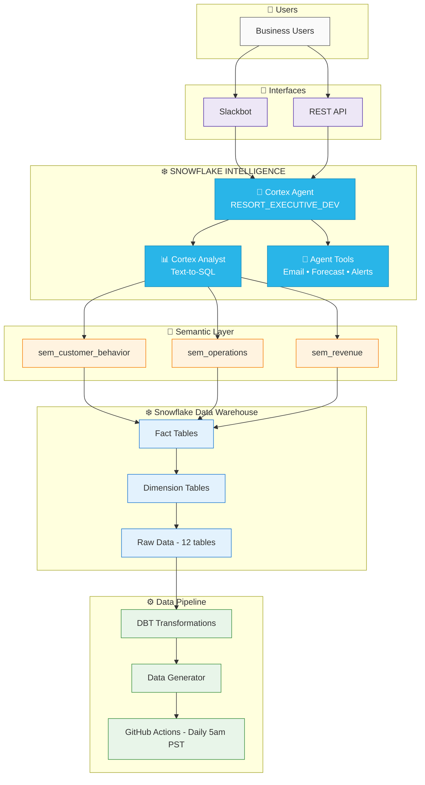

# Ski Resort Analytics Platform

> **Powered by Snowflake Intelligence** - Natural language analytics for ski resort operations

---

## 🧠 Snowflake Intelligence at the Core

This platform demonstrates the power of **Snowflake Cortex Intelligence** - enabling business users to ask questions in plain English and get instant, accurate answers from complex operational data.

| Snowflake Intelligence Feature | How It's Used |
|-------------------------------|---------------|
| **Cortex Analyst** | Text-to-SQL via semantic models |
| **Cortex Agent** | Multi-tool orchestration & reasoning |
| **Semantic Views** | Business context for AI understanding |
| **Cortex ML Functions** | Visitor forecasting & predictions |

---

## Architecture Diagram



---

## Component Details

### 1. Data Generation Layer

| Component | Purpose | Key Features |
|-----------|---------|--------------|
| `generate_daily_increment.py` | Creates realistic ski resort data | 8,000 customers, 7 segments, seasonal patterns |
| GitHub Actions Workflow | Automated daily refresh | 5am PST, auto-backfill, gap detection |

**Customer Segments Modeled:**
- 🎿 Local Pass Holders (15%) - 25-40 visits/season
- 🏔️ Weekend Warriors (25%) - Peak Saturdays
- 👨‍👩‍👧‍👦 Vacation Families (30%) - High spend, 3-7 day stays
- 🚗 Day Trippers (20%) - Spontaneous, weather-driven
- ⛷️ Expert Skiers (5%) - Powder chasers, first chair
- 🏢 Corporate Groups (3%) - Events, private dining
- 🐣 Beginners (2%) - Conversion opportunities

### 2. Snowflake Database Structure

```
SKI_RESORT_DB/
├── RAW/                    # Raw transactional data
│   ├── PASS_USAGE         # Daily customer visits
│   ├── LIFT_SCANS         # Individual lift rides
│   ├── TICKET_SALES       # Ticket/pass purchases
│   ├── FOOD_BEVERAGE      # F&B transactions
│   ├── RENTALS            # Equipment rentals
│   ├── SKI_LESSONS        # Lesson bookings
│   ├── WEATHER_CONDITIONS # Daily weather
│   ├── STAFFING_SCHEDULE  # Staff assignments
│   ├── INCIDENTS          # Safety incidents
│   ├── CUSTOMER_FEEDBACK  # Surveys & reviews
│   ├── PARKING_OCCUPANCY  # Parking utilization
│   └── GROOMING_LOGS      # Trail maintenance
│
├── STAGING/               # DBT staging models
│
├── MARTS/                 # DBT dimensional models
│   ├── dim_date          # Calendar with ski season attrs
│   ├── dim_customer      # Type 2 SCD, segments
│   ├── dim_lift          # Lift capacity, terrain
│   ├── dim_location      # Venues, rental shops
│   ├── dim_product       # F&B items, rentals
│   ├── dim_ticket_type   # Pass/ticket types
│   ├── fact_lift_scans   # 15M+ lift rides
│   ├── fact_pass_usage   # Daily visit summaries
│   ├── fact_ticket_sales # Revenue by channel
│   ├── fact_rentals      # Equipment rentals
│   └── fact_food_beverage # F&B sales
│
├── SEMANTIC/              # Semantic views for Cortex
│   ├── sem_customer_behavior
│   ├── sem_operations
│   └── sem_revenue
│
└── AGENTS/                # Agent definitions
    └── RESORT_EXECUTIVE_DEV
```

### 3. DBT Transformation Pipeline

```yaml
# Incremental strategy for fact tables
models:
  - name: fact_lift_scans
    config:
      materialized: incremental
      unique_key: scan_id
      incremental_strategy: merge
```

**Key Transformations:**
- Deduplication & data quality checks
- Type 2 SCD for customer dimension
- Incremental fact table loads
- Semantic view generation with `dbt_semantic_view`

### 4. Semantic Layer

Each semantic view is designed for Cortex Analyst to understand business context:

| View | Business Domain | Key Metrics |
|------|-----------------|-------------|
| `sem_customer_behavior` | Customer analytics | LTV, visit frequency, churn risk, segment analysis |
| `sem_operations` | Lift operations | Utilization, wait times, capacity, bottlenecks |
| `sem_revenue` | Financial performance | Revenue by source, trends, pricing optimization |

### 5. Cortex Intelligence Agent

**Agent: `RESORT_EXECUTIVE_DEV`**

```yaml
tools:
  - cortex_analyst       # Text-to-SQL via semantic views
  - forecast_visitors    # ML-based predictions
  - send_email          # Formatted report delivery
  - schedule_alert      # Recurring insights
```

**Capabilities:**
- Natural language to SQL translation
- Multi-step reasoning across data domains
- Formatted email reports with charts
- Scheduled automated insights

### 6. Slackbot Interface

```
slack_bot/
├── bot.py           # Main Slack app, event handlers
├── agent.py         # Cortex Agent client
├── formatters.py    # Slack Block Kit formatting
├── context.py       # Multi-turn conversation memory
└── config.yml       # Agent mappings, settings
```

**Features:**
- Natural language queries via `@mention` or `/ask`
- Rich Block Kit responses with tables
- Multi-turn conversation context
- Progress indicators during agent processing

---

## Data Flow

```
┌─────────────────────────────────────────────────────────────────────────┐
│                          DAILY DATA PIPELINE                            │
├─────────────────────────────────────────────────────────────────────────┤
│                                                                         │
│  ┌──────────────┐    ┌──────────────┐    ┌──────────────┐              │
│  │   GitHub     │    │    Python    │    │   Snowflake  │              │
│  │   Actions    │───▶│  Generator   │───▶│   RAW Tables │              │
│  │  (5am PST)   │    │              │    │              │              │
│  └──────────────┘    └──────────────┘    └──────────────┘              │
│                                                 │                       │
│                                                 ▼                       │
│                                          ┌──────────────┐              │
│                                          │     DBT      │              │
│                                          │  Transform   │              │
│                                          └──────────────┘              │
│                                                 │                       │
│                            ┌────────────────────┼────────────────────┐ │
│                            ▼                    ▼                    ▼ │
│                     ┌──────────┐         ┌──────────┐         ┌──────┐│
│                     │ Staging  │         │   Dims   │         │Facts ││
│                     │ Models   │         │          │         │      ││
│                     └──────────┘         └──────────┘         └──────┘│
│                                                 │                       │
│                                                 ▼                       │
│                                          ┌──────────────┐              │
│                                          │   Semantic   │              │
│                                          │    Views     │              │
│                                          └──────────────┘              │
│                                                                         │
└─────────────────────────────────────────────────────────────────────────┘

┌─────────────────────────────────────────────────────────────────────────┐
│                          QUERY FLOW                                     │
├─────────────────────────────────────────────────────────────────────────┤
│                                                                         │
│  ┌──────────────┐    ┌──────────────┐    ┌──────────────┐              │
│  │    User      │    │   Slackbot   │    │   Cortex     │              │
│  │   Question   │───▶│   or API     │───▶│    Agent     │              │
│  │              │    │              │    │              │              │
│  └──────────────┘    └──────────────┘    └──────────────┘              │
│                                                 │                       │
│                                                 ▼                       │
│                                          ┌──────────────┐              │
│                                          │   Cortex     │              │
│                                          │   Analyst    │              │
│                                          └──────────────┘              │
│                                                 │                       │
│                                                 ▼                       │
│                                          ┌──────────────┐              │
│                                          │   Semantic   │              │
│                                          │    Views     │              │
│                                          └──────────────┘              │
│                                                 │                       │
│                                                 ▼                       │
│  ┌──────────────┐    ┌──────────────┐    ┌──────────────┐              │
│  │   Formatted  │◀───│    Agent     │◀───│     SQL      │              │
│  │   Response   │    │   Response   │    │   Results    │              │
│  └──────────────┘    └──────────────┘    └──────────────┘              │
│                                                                         │
└─────────────────────────────────────────────────────────────────────────┘
```

---

## Key Technologies

| Layer | Technology | Purpose |
|-------|------------|---------|
| Data Generation | Python, NumPy | Realistic pattern simulation |
| Orchestration | GitHub Actions | Scheduled pipeline execution |
| Storage | Snowflake | Cloud data warehouse |
| Transformation | DBT | Dimensional modeling, incremental loads |
| Semantic Layer | Snowflake Semantic Views | Business context for AI |
| AI/ML | Snowflake Cortex | Analyst, Agent, ML functions |
| Interface | Slack Bolt | Natural language chat interface |
| CLI | Snowflake CLI | Deployment & management |

---

## Directory Structure

```
Manage-Snowflake-Agents/
│
├── 📊 data_generation/
│   ├── generate_daily_increment.py    # Main data generator
│   └── utils/                         # Snowflake connection utils
│
├── 🔄 dbt_ski_resort/
│   ├── models/
│   │   ├── staging/                   # Source cleaning
│   │   └── marts/
│   │       ├── dims/                  # Dimension tables
│   │       ├── facts/                 # Fact tables
│   │       └── semantic/              # Semantic views
│   ├── packages.yml                   # dbt_semantic_view
│   └── profiles.yml                   # Snowflake connection
│
├── 🤖 snowflake_agents/
│   └── agents/
│       └── resort_executive.yml       # Agent definition
│
├── 🔧 agent_tools/
│   ├── src/
│   │   ├── email_tools/               # Email sending
│   │   └── scheduled_alerts/          # Alert system
│   └── snowflake.yml                  # Tool deployment config
│
├── 💬 slack_bot/
│   ├── bot.py                         # Main Slack app
│   ├── agent.py                       # Agent client
│   ├── formatters.py                  # Block Kit formatting
│   └── context.py                     # Conversation memory
│
├── ⚙️ .github/
│   └── workflows/
│       └── daily_data_refresh.yml     # Automated pipeline
│
└── 📋 semantic_models/
    └── ski_resort_semantic.yaml       # Cortex Analyst config
```

---

## Sample Queries

The agent can answer questions like:

| Category | Example Question |
|----------|------------------|
| **Revenue** | "What's our total revenue by business unit this week?" |
| **Customers** | "Which customer segments have the highest lifetime value?" |
| **Operations** | "What's the average wait time at Summit Express on weekends?" |
| **Weather Impact** | "How does a powder day affect attendance 24 hours later?" |
| **Forecasting** | "Predict visitor count for next Saturday" |
| **Trends** | "Show me the revenue trend for December vs last year" |

---

## Getting Started

```bash
# 1. Clone and setup
git clone https://github.com/Jeremy-Demlow/Manage-Snowflake-Agents.git
cd Manage-Snowflake-Agents

# 2. Generate initial data
cd data_generation
python generate_daily_increment.py --date 2025-12-01 --days 7

# 3. Run DBT transformations
cd ../dbt_ski_resort
dbt deps
dbt run

# 4. Deploy agent
cd ../snowflake_agents
snow cortex agent deploy agents/resort_executive.yml

# 5. Start Slackbot (optional)
cd ../slack_bot
export SLACK_BOT_TOKEN=xoxb-...
export SLACK_APP_TOKEN=xapp-...
python bot.py
```

---

## Recovery & Maintenance

| Scenario | Solution |
|----------|----------|
| Missing data | Workflow auto-detects and backfills |
| Data corruption | Manual trigger with `rebuild_from_date` |
| DBT failures | Manual trigger with `full_refresh: true` |
| Complete rebuild | Use `clear_raw_data` + `rebuild_from_date` |

---

*Built with ❄️ Snowflake Cortex Intelligence*
